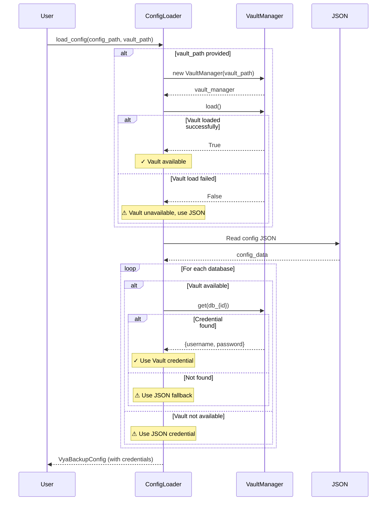

# Vault + ConfigLoader Integration Guide

**Data:** 2026-01-29  
**Versão:** v2.0.0  
**Status:** ✅ IMPLEMENTED

## 📋 Visão Geral

O **VaultManager** foi integrado ao **ConfigLoader** para fornecer gerenciamento seguro de credenciais com sistema de prioridade e fallback automático.

### Arquitetura de Prioridade

```
┌─────────────────────────────────────────┐
│      ConfigLoader.from_file()           │
│                                         │
│  1. Try: VaultManager.get(key)          │
│     ├─ Success → Use Vault Credential   │
│     └─ Not Found → Fallback to JSON     │
│                                         │
│  2. Log: ✓ ou ⚠ (source indicator)     │
│                                         │
│  3. Result: Credentials loaded          │
└─────────────────────────────────────────┘
```

## 🔑 Convenções de Chaves do Vault

### Banco de Dados
- **Formato:** `db_{id_dbms}`
- **Exemplos:**
  - `db_1` → Banco com `id_dbms=1`
  - `db_2` → Banco com `id_dbms=2`
  - `db_10` → Banco com `id_dbms=10`

### SMTP (Email)
- **Chave:** `smtp`
- **Campos:** `username` e `password`

## 🚀 Como Usar

### 1. Adicionar Credenciais ao Vault

```bash
# Adicionar credencial de banco de dados
vault-add --id db_1 \
  --username mysql_user \
  --password SecureP@ssw0rd

# Adicionar credencial SMTP
vault-add --id smtp \
  --username smtp@example.com \
  --password SmtpP@ss123
```

### 2. Carregar Configuração com Vault

```python
from pathlib import Path
from python_backup.config.loader import load_config

# Método 1: Caminho padrão do vault (.secrets/vault.json.enc)
config = load_config(
    config_path=Path("config/vya_backupbd.json")
)

# Método 2: Caminho customizado do vault
config = load_config(
    config_path=Path("config/vya_backupbd.json"),
    vault_path=Path("/etc/vya_backup/.secrets/vault.json.enc")
)

# Método 3: Sem vault (apenas JSON)
config = load_config(
    config_path=Path("config/vya_backupbd.json"),
    vault_path=None
)
```

### 3. Verificar Fonte das Credenciais

Os logs indicam a fonte de cada credencial:

```
✓ Credentials for database ID 1 loaded from Vault
⚠ Credentials for database ID 2 not found in Vault (key: db_2), using JSON fallback
✓ SMTP credentials loaded from Vault
```

## 📊 Cenários de Uso

### Cenário 1: Todas Credenciais no Vault (Recomendado)

```bash
# Setup
vault-add --id db_1 --username user1 --password pass1
vault-add --id db_2 --username user2 --password pass2
vault-add --id smtp --username smtp@mail.com --password smtppass

# Resultado
# ✓ Todas credenciais carregadas do Vault
# ✓ JSON usado apenas para configurações não-sensíveis
```

### Cenário 2: Migração Gradual (Vault + JSON)

```bash
# Setup: Apenas db_1 no vault
vault-add --id db_1 --username user1 --password pass1

# Resultado
# ✓ db_1 credenciais do Vault
# ⚠ db_2 credenciais do JSON (fallback)
# ⚠ SMTP credenciais do JSON (fallback)
```

### Cenário 3: Desenvolvimento sem Vault

```python
# config = load_config(vault_path=None)
# ⚠ Todas credenciais carregadas do JSON
```

## 🔐 Segurança

### Proteção de Credenciais

1. **Vault:**
   - Arquivo: `.secrets/vault.json.enc`
   - Criptografia: Fernet (AES-128-CBC + HMAC-SHA256)
   - Permissões: `0600` (somente proprietário)
   - Chave: Baseada no hostname

2. **JSON (Fallback):**
   - Arquivo: `config/vya_backupbd.json`
   - ⚠️ Credenciais em texto claro
   - Recomendação: Migrar para Vault

### Rotação de Credenciais

```bash
# 1. Atualizar credencial no serviço (cPanel/SQL)

# 2. Atualizar no Vault
vault-add --id db_1 \
  --username mysql_user \
  --password NewSecureP@ssw0rd

# 3. Testar conexão
test-connection --instance db_1

# 4. Remover do JSON (opcional)
# Editar vya_backupbd.json e substituir por placeholder
```

## 📝 Estrutura de Dados

### VaultManager.get() Retorna

```python
{
    "username": "decrypted_username",
    "password": "decrypted_password"
}
```

### DatabaseConfig Recebe

```python
DatabaseConfig(
    id_dbms=1,
    dbms="mysql",
    host="mysql.example.com",
    port=3306,
    user="vault_username",      # Do Vault ou JSON
    secret="vault_password",     # Do Vault ou JSON
    db_ignore=["sys"],
    database=[],
    enabled=True
)
```

## 🧪 Testes

### Executar Testes de Integração

```bash
# Todos os testes de integração Vault + Config
pytest tests/integration/test_vault_config_integration.py -v

# Testes específicos
pytest tests/integration/test_vault_config_integration.py::TestVaultConfigIntegration::test_load_config_with_vault_priority -v
```

### Cobertura de Testes

| Cenário | Teste | Status |
|---------|-------|--------|
| Sem Vault (JSON only) | `test_load_config_without_vault` | ✅ |
| Vault Priority | `test_load_config_with_vault_priority` | ✅ |
| Vault Fallback | `test_load_config_vault_fallback_to_json` | ✅ |
| VaultManager Reference | `test_vault_manager_reference_stored` | ✅ |
| Vault Load Failure | `test_vault_load_failure_fallback` | ✅ |
| Partial Coverage | `test_partial_vault_coverage` | ✅ |
| All from Vault | `test_all_credentials_from_vault` | ✅ |
| Disabled DB | `test_disabled_database_credentials_not_loaded` | ✅ |

**Total:** 8/8 testes passando ✅

## 🔄 Fluxo de Carregamento



## 🛠️ Troubleshooting

### Problema: Credenciais não carregadas do Vault

**Sintomas:**
```
⚠ Credentials for database ID 1 not found in Vault (key: db_1), using JSON fallback
```

**Soluções:**
```bash
# 1. Verificar se credencial existe
vault-list

# 2. Verificar chave exata
# Deve ser "db_1", "db_2", etc. (não "database_1")

# 3. Adicionar credencial
vault-add --id db_1 --username user --password pass

# 4. Verificar permissões do arquivo vault
ls -la .secrets/vault.json.enc
# Deve ser -rw------- (600)
```

### Problema: Vault não carrega

**Sintomas:**
```
VaultManager failed to load from /path/vault.json.enc, will use JSON fallback
```

**Soluções:**
```bash
# 1. Verificar se arquivo existe
ls -la .secrets/vault.json.enc

# 2. Criar vault vazio se não existe
mkdir -p .secrets
vault-add --id test --username test --password test
vault-remove --id test

# 3. Verificar integridade do arquivo
# Se corrompido, restore do backup ou recrie
```

### Problema: Erro de import VaultManager

**Sintomas:**
```python
ModuleNotFoundError: No module named 'python_backup.security.vault'
```

**Soluções:**
```bash
# 1. Verificar instalação do pacote
uv pip list | grep python-backup

# 2. Reinstalar em modo desenvolvimento
uv pip install -e .

# 3. Verificar PYTHONPATH
echo $PYTHONPATH
```

## 📚 Referências

- [Vault Manager Documentation](../modules/VAULT_MANAGER.md)
- [Security Audit 2026-01-15](../SECURITY_AUDIT_2026-01-15.md)
- [Config Loader API](../../src/python_backup/config/loader.py)
- [Integration Tests](../../tests/integration/test_vault_config_integration.py)

## 🎯 Próximos Passos

1. ✅ Implementar integração Vault + ConfigLoader
2. ⏳ Rotacionar credenciais expostas (T-SECURITY-002-ROTATION)
3. ⏳ Criar script de migração JSON → Vault
4. ⏳ Implementar backup/restore do Vault
5. ⏳ Adicionar suporte a múltiplas instâncias de Vault

---

**Última Atualização:** 2026-01-29  
**Implementado por:** T-VAULT-INTEGRATION  
**Testes:** 8 testes de integração, 100% passing
