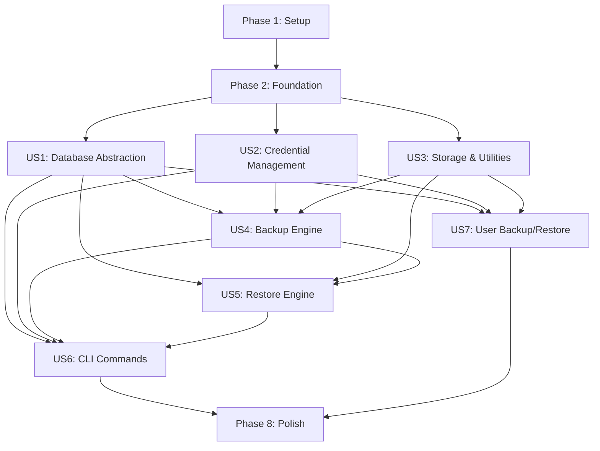

# Tasks: Phase 2 - Core Development

**Input**: Design documents from [specs/001-phase2-core-development/](.)  
**Prerequisites**: [plan.md](plan.md), [spec.md](spec.md), [research.md](research.md), [data-model.md](data-model.md), [contracts/](contracts/)

**Organization**: Tasks are grouped by functional area (mapped to user stories) to enable independent implementation and testing.

**Tests**: Following TDD approach - tests written first, approved, then implementation.

---

## ⚠️ Workspace Context - READ FIRST

> **CRITICAL**: Este workspace VSCode contém múltiplos diretórios para referência.

**✅ Projeto Ativo** (trabalhe SOMENTE aqui):
- `enterprise-vya-backupdb/` ← você está aqui
- Branch: `001-phase2-core-development`
- Todos os arquivos criados devem estar em `src/vya_backupbd/`
- Todos os testes em `tests/`

**⛔ Diretórios de Referência** (NÃO MODIFICAR):
- `../vya_backupbd/` - Código legado para consulta
- `../enterprise-vya_backupbd/` - Scripts produção para consulta

Durante a implementação das tasks abaixo:
1. **Sempre use caminhos absolutos** começando com `src/vya_backupbd/`
2. **Nunca modifique** arquivos em `../vya_backupbd/` ou `../enterprise-vya_backupbd/`
3. **Consulte código legado** quando necessário, mas implemente no projeto ativo
4. **Todos os commits** devem ser no repositório `enterprise-vya-backupdb/`

---

## Format: `- [ ] [ID] [P?] [Story] Description`

- **[P]**: Can run in parallel (different files, no dependencies)
- **[Story]**: Which user story this task belongs to (US1, US2, US3, etc.)
- Include exact file paths in descriptions

---

## Phase 1: Setup (Shared Infrastructure)

**Purpose**: Project initialization and basic structure

- [X] T001 Create project structure with src/vya_backupbd/ and tests/ directories
- [X] T002 Initialize pyproject.toml with Python 3.11+ and dependencies (SQLAlchemy 2.0+, Pydantic v2, Typer, Rich, cryptography, pymysql, psycopg3)
- [X] T003 [P] Configure pytest with pytest.ini (coverage, asyncio settings)
- [X] T004 [P] Create .gitignore (exclude .secrets/, __pycache__, .pytest_cache, etc.)
- [X] T005 [P] Create README.md with project overview and setup instructions
- [X] T006 [P] Setup black and ruff configuration for code formatting/linting
- [X] T007 Create config/ directory with config.example.yaml template
- [X] T008 Create .secrets/ directory structure (gitignored)

---

## Phase 2: Foundational (Blocking Prerequisites)

**Purpose**: Core infrastructure that MUST be complete before ANY user story can be implemented

**⚠️ CRITICAL**: No user story work can begin until this phase is complete

- [X] T009 Create src/vya_backupbd/__init__.py with version and package metadata
- [X] T010 [P] Create tests/__init__.py
- [X] T011 [P] Create tests/conftest.py with pytest fixtures (tmp_path, mock configs)
- [X] T012 Create src/vya_backupbd/config.py with Pydantic models (AppConfig, DatabaseConfig, StorageConfig, RetentionConfig, LoggingConfig per data-model.md)
- [X] T013 Create tests/unit/test_config.py with config validation tests
- [X] T014 Create src/vya_backupbd/security/encryption.py with Fernet encryption utilities (hostname-based key derivation per research.md)
- [X] T015 Create tests/unit/test_encryption.py with encryption/decryption tests

**Checkpoint**: Foundation ready - user story implementation can now begin in parallel

---

## Phase 3: User Story 1 - Database Abstraction Layer (Priority: P1) 🎯 MVP

**Goal**: Implement SQLAlchemy-based database abstraction with MySQL and PostgreSQL support

**Independent Test**: Connect to test MySQL/PostgreSQL containers, list databases, execute test queries

### Tests for User Story 1 (TDD - Write First)

- [ ] T016 [P] [US1] Create tests/unit/test_db_engine.py with SQLAlchemy engine factory tests
- [ ] T017 [P] [US1] Create tests/unit/test_db_base.py with abstract base adapter tests
- [ ] T018 [P] [US1] Create tests/unit/test_db_mysql.py with MySQL adapter tests
- [ ] T019 [P] [US1] Create tests/unit/test_db_postgresql.py with PostgreSQL adapter tests
- [ ] T020 [P] [US1] Create tests/integration/test_mysql_connection.py with testcontainers MySQL tests
- [ ] T021 [P] [US1] Create tests/integration/test_postgresql_connection.py with testcontainers PostgreSQL tests

### Implementation for User Story 1

- [ ] T022 [P] [US1] Create src/vya_backupbd/db/__init__.py
- [ ] T023 [US1] Create src/vya_backupbd/db/engine.py with SQLAlchemy engine factory (async support per research.md)
- [ ] T024 [US1] Create src/vya_backupbd/db/base.py with abstract DatabaseAdapter interface (list_databases, test_connection, get_database_info)
- [ ] T025 [US1] Implement src/vya_backupbd/db/mysql.py with MySQLAdapter (mysql+pymysql, system DB exclusion)
- [ ] T026 [US1] Implement src/vya_backupbd/db/postgresql.py with PostgreSQLAdapter (postgresql+psycopg, system DB exclusion)
- [ ] T027 [US1] Add connection pooling and error handling to adapters
- [ ] T028 [US1] Add logging for database operations

**Checkpoint**: Database abstraction layer complete - can connect to MySQL/PostgreSQL, list databases

---

## Phase 4: User Story 2 - Credential Management (Priority: P1) 🎯 MVP

**Goal**: Implement secure credential management with Fernet encryption

**Independent Test**: Encrypt plain-text credentials, decrypt, verify no plain-text passwords in logs

### Tests for User Story 2 (TDD - Write First)

- [ ] T029 [P] [US2] Create tests/unit/test_credentials.py with credential manager tests (encrypt, decrypt, load, save)
- [ ] T030 [P] [US2] Create tests/integration/test_credentials_e2e.py with end-to-end credential lifecycle tests

### Implementation for User Story 2

- [ ] T031 [P] [US2] Create src/vya_backupbd/security/__init__.py
- [ ] T032 [US2] Create src/vya_backupbd/security/credentials.py with CredentialsManager (load from .secrets/credentials.json, decrypt on demand)
- [ ] T033 [US2] Implement hostname-based key derivation in encryption.py (per research.md algorithm)
- [ ] T034 [US2] Add credential validation (match config database IDs)
- [ ] T035 [US2] Add log sanitization to prevent password leaks
- [ ] T036 [US2] Implement file permissions check (0600 for .secrets/credentials.json)

**Checkpoint**: Credential management complete - can securely store/retrieve database credentials

---

## Phase 5: User Story 3 - Storage & Utilities (Priority: P1) 🎯 MVP

**Goal**: Implement file system storage, compression, and metadata management

**Independent Test**: Create backup directory structure, compress files, generate metadata JSON, verify checksums

### Tests for User Story 3 (TDD - Write First)

- [ ] T037 [P] [US3] Create tests/unit/test_filesystem.py with filesystem utilities tests (ensure_directory, generate_path, calculate_checksum)
- [ ] T038 [P] [US3] Create tests/unit/test_compression.py with gzip compression/decompression tests
- [ ] T039 [P] [US3] Create tests/unit/test_metadata.py with metadata JSON generation/validation tests

### Implementation for User Story 3

- [ ] T040 [P] [US3] Create src/vya_backupbd/utils/__init__.py
- [ ] T041 [P] [US3] Create src/vya_backupbd/utils/filesystem.py with storage utilities (ensure_directory, generate_backup_path, calculate_checksum, set_permissions)
- [ ] T042 [P] [US3] Create src/vya_backupbd/utils/compression.py with gzip utilities (compress_file, decompress_file with configurable level)
- [ ] T043 [US3] Create src/vya_backupbd/utils/metadata.py with BackupMetadata model and JSON serialization (per data-model.md)
- [ ] T044 [US3] Implement backup path generation: {hostname}/{db_id}/{db_name}/{date}/
- [ ] T045 [US3] Add disk space checking utilities

**Checkpoint**: Storage infrastructure complete - can manage backup files, compression, metadata

---

## Phase 6: User Story 4 - Backup Engine (Priority: P1) 🎯 MVP

**Goal**: Implement per-database backup functionality for MySQL and PostgreSQL

**Independent Test**: Backup a test database (MySQL), verify .sql.gz file, validate metadata, restore to verify integrity

### Tests for User Story 4 (TDD - Write First)

- [ ] T046 [P] [US4] Create tests/unit/test_backup.py with BackupController tests
- [ ] T047 [P] [US4] Create tests/integration/test_mysql_backup.py with full MySQL backup workflow tests
- [ ] T048 [P] [US4] Create tests/integration/test_postgresql_backup.py with full PostgreSQL backup workflow tests

### Implementation for User Story 4

- [ ] T049 [P] [US4] Create src/vya_backupbd/core/__init__.py
- [ ] T050 [US4] Create src/vya_backupbd/core/backup.py with BackupController (orchestrate per-database backup)
- [ ] T051 [US4] Implement MySQL backup logic using mysqldump equivalent via SQLAlchemy
- [ ] T052 [US4] Implement PostgreSQL backup logic using pg_dump equivalent via SQLAlchemy
- [ ] T053 [US4] Add backup validation (verify SQL integrity before compression)
- [ ] T054 [US4] Implement metadata generation for each backup (timestamp, size, checksum, database info)
- [ ] T055 [US4] Add progress reporting with Rich progress bars
- [ ] T056 [US4] Implement dry-run mode (test without actual backup)
- [ ] T057 [US4] Add error recovery and cleanup on failure

**Checkpoint**: Backup engine complete - can backup MySQL/PostgreSQL databases individually

---

## Phase 7: User Story 5 - Restore Engine (Priority: P1) 🎯 MVP

**Goal**: Implement database restore functionality with validation

**Independent Test**: Restore from backup file, verify database content matches original

### Tests for User Story 5 (TDD - Write First)

- [ ] T058 [P] [US5] Create tests/unit/test_restore.py with RestoreManager tests
- [ ] T059 [P] [US5] Create tests/integration/test_mysql_restore.py with full MySQL restore workflow tests
- [ ] T060 [P] [US5] Create tests/integration/test_postgresql_restore.py with full PostgreSQL restore workflow tests

### Implementation for User Story 5

- [ ] T061 [US5] Create src/vya_backupbd/core/restore.py with RestoreManager
- [ ] T062 [US5] Implement backup file discovery and listing
- [ ] T063 [US5] Implement metadata validation (checksum verification)
- [ ] T064 [US5] Implement MySQL restore logic (decompress, parse SQL, execute)
- [ ] T065 [US5] Implement PostgreSQL restore logic (decompress, parse SQL, execute)
- [ ] T066 [US5] Add dry-run mode for restore (validate without executing)
- [ ] T067 [US5] Implement database drop/create before restore (with confirmation)
- [ ] T068 [US5] Add progress reporting for restore operations
- [ ] T069 [US5] Add restore verification (row counts, basic integrity checks)

**Checkpoint**: Restore engine complete - can restore databases from backup files

---

## Phase 8: User Story 6 - CLI Commands (Priority: P1) 🎯 MVP

**Goal**: Implement Typer-based CLI with all essential commands

**Independent Test**: Run each CLI command, verify output, test error handling

### Tests for User Story 6 (TDD - Write First)

- [ ] T070 [P] [US6] Create tests/unit/test_cli.py with CLI command tests (using Typer's CliRunner)
- [ ] T071 [P] [US6] Create tests/integration/test_end_to_end.py with full CLI workflows (backup → list → restore)

### Implementation for User Story 6

- [ ] T072 [P] [US6] Create src/vya_backupbd/__main__.py as CLI entry point
- [ ] T073 [US6] Create src/vya_backupbd/cli.py with Typer app initialization
- [ ] T074 [US6] Implement `backup` command (--instance, --database, --all, --dry-run, --compression)
- [ ] T075 [US6] Implement `restore list` command (--instance, --database, --date, --limit)
- [ ] T076 [US6] Implement `restore` command (--file, --latest, --datetime, --target-database, --dry-run, --force)
- [ ] T077 [US6] Implement `config validate` command
- [ ] T078 [US6] Implement `config show` command (--format, --no-secrets)
- [ ] T079 [US6] Implement `config test-connections` command (--instance)
- [ ] T080 [US6] Implement `credentials encrypt` command (--input, --output, --force)
- [ ] T081 [US6] Implement `status` command (--last-backup, --summary)
- [ ] T082 [US6] Implement `health` command (for monitoring)
- [ ] T083 [US6] Add Rich formatting for all output (tables, progress bars, colors)
- [ ] T084 [US6] Add global options (--config, --verbose, --quiet, --version)
- [ ] T085 [US6] Implement exit codes per contracts/cli-contract.md

**Checkpoint**: CLI complete - all commands functional with proper output and error handling

---

## Phase 7: User Story 7 - User/Role Backup & Restore (Priority: P1) 🎯 MVP

**Goal**: Implement backup and restore of database users, roles, and permissions (separate from database data)

**Independent Test**: Backup all users from MySQL/PostgreSQL instance, restore to empty server, verify users and permissions exist

### Tests for User Story 7 (TDD - Write First)

- [ ] T086 [P] [US7] Create tests/unit/test_users_backup.py with user backup tests (MySQL SHOW GRANTS, PostgreSQL pg_dumpall)
- [ ] T087 [P] [US7] Create tests/unit/test_users_restore.py with user restore tests (global and single user)
- [ ] T088 [P] [US7] Create tests/integration/test_mysql_users.py with MySQL user backup/restore workflow
- [ ] T089 [P] [US7] Create tests/integration/test_postgresql_users.py with PostgreSQL user backup/restore workflow

### Implementation for User Story 7

- [ ] T090 [P] [US7] Create src/vya_backupbd/core/__init__.py update to export users module
- [ ] T091 [US7] Create src/vya_backupbd/core/users.py with UsersManager class
- [ ] T092 [US7] Implement MySQL user backup (query mysql.user + SHOW GRANTS for each user)
- [ ] T093 [US7] Implement PostgreSQL user backup (subprocess pg_dumpall --roles-only)
- [ ] T094 [US7] Implement user backup compression and metadata generation
- [ ] T095 [US7] Implement user list/discovery from backup files
- [ ] T096 [US7] Implement global user restore (all users from backup file)
- [ ] T097 [US7] Implement single user restore (extract specific user from backup)
- [ ] T098 [US7] Add user exclusion filter (skip root, mysql.sys, postgres, etc.)
- [ ] T099 [US7] Implement CLI command: `users backup --instance ID --output FILE`
- [ ] T100 [US7] Implement CLI command: `users list --file FILE` (show backed-up users)
- [ ] T101 [US7] Implement CLI command: `users restore --file FILE [--all | --user USER]`
- [ ] T102 [US7] Add dry-run mode for user restore
- [ ] T103 [US7] Add conflict detection (user already exists on target)
- [ ] T104 [US7] Add logging for user backup/restore operations

**Checkpoint**: User backup/restore complete - can backup all users, restore globally or individually

---

## Phase 8: Polish & Cross-Cutting Concerns

**Purpose**: Final touches for production readiness

- [ ] T105 [P] Create config/config.example.yaml with documented examples
- [ ] T106 [P] Update README.md with complete usage documentation
- [ ] T107 [P] Create CONTRIBUTING.md with development guidelines
- [ ] T108 [P] Add docstrings to all public functions and classes
- [ ] T109 Run black formatting on all source files
- [ ] T110 Run ruff linting and fix all issues
- [ ] T111 Run mypy type checking and resolve issues
- [ ] T112 Verify >80% test coverage (pytest --cov)
- [ ] T113 Create example scripts for common use cases
- [ ] T114 Add error messages documentation
- [ ] T115 Review and update all logging statements
- [ ] T116 Create deployment guide in docs/
- [ ] T117 Add performance benchmarks to documentation
- [ ] T118 Final end-to-end testing (backup → users backup → restore → users restore → verify)
- [ ] T119 Security audit (credentials, file permissions, log sanitization)

---

## Dependencies Between User Stories



**Critical Path**: Setup → Foundation → (US1, US2, US3 in parallel) → (US4, US5, US7 depend on US1-3) → US6 → Polish

---

## Parallel Execution Opportunities

### After Foundation (Phase 2):
**Can work in parallel** (different files, no dependencies):
- US1 tests (T016-T021) + US2 tests (T029-T030) + US3 tests (T037-T039)
- US1 implementation (T022-T028) + US2 implementation (T031-T036) + US3 implementation (T040-T045)

### After US1, US2, US3:
**Can work in parallel**:
- US4 tests (T046-T048) + US5 tests (T058-T060) + US7 tests (T086-T089)
- US4 implementation + US5 implementation + US7 implementation (different modules)

### Polish Phase:
**Can work in parallel** (T105-T108):
- Documentation updates
- Code quality tasks
- Example creation

---

## Implementation Strategy

### MVP Scope (Minimum Viable Product)

**Target**: User Story 1-7 complete → fully functional backup/restore system with user management

**Includes**:
- ✅ Database abstraction (MySQL + PostgreSQL)
- ✅ Secure credential management
- ✅ Per-database backup
- ✅ Restore functionality
- ✅ **User/role backup & restore** (global + single user) 🆕
- ✅ CLI with all essential commands
- ✅ >80% test coverage

**Complete Disaster Recovery Capability**:
```bash
# Full DR workflow to empty server
1. vya-backupdb users backup --instance prod-mysql-01
2. vya-backupdb backup --instance prod-mysql-01 --all
3. [On target server]
4. vya-backupdb users restore --file users_backup.sql.gz --target-instance new-server --all
5. vya-backupdb restore --instance prod-mysql-01 --database mydb --latest
```

**Excludes** (Future Phases):
- ❌ Parallel backups (Phase 6)
- ❌ GFS retention automation (Phase 3)
- ❌ Prometheus metrics (Phase 4)
- ❌ Email notifications (Phase 5)

### Delivery Approach

1. **Sprint 1 (Week 1-2)**: US1, US2 → Database access + credentials
2. **Sprint 2 (Week 3-4)**: US3, US4 → Storage + backup functionality
3. **Sprint 3 (Week 5-6)**: US5, US7 → Restore + user management
4. **Sprint 4 (Week 7)**: US6 + Polish → CLI + final touches → **MVP Release**

### Testing Strategy (TDD)

For each user story:
1. **Write tests first** (unit + integration)
2. **Review tests** (ensure coverage of requirements)
3. **Run tests** (should FAIL initially - red state)
4. **Implement code** to pass tests (green state)
5. **Refactor** for code quality (refactor state)
6. **Verify coverage** (>80% target)

---

## Success Criteria

**Definition of Done** for Phase 2:
- [ ] All 119 tasks completed
- [ ] All tests passing (unit + integration)
- [ ] Test coverage >80%
- [ ] All CLI commands functional per contracts/cli-contract.md
- [ ] Zero plain-text credentials in codebase
- [ ] Documentation complete (README, quickstart, examples)
- [ ] Code formatted (black) and linted (ruff)
- [ ] Type hints validated (mypy)
- [ ] End-to-end workflow tested: 
  - config → encrypt credentials → backup databases → backup users → 
  - list backups → restore users → restore databases → verify
- [ ] Security audit passed (no credentials in logs, proper file permissions)
- [ ] **Disaster Recovery validated**: Full restore to empty server works

---

## Task Summary

- **Total Tasks**: 119 tasks organized into 8 phases
- **Setup**: 8 tasks (T001-T008)
- **Foundation**: 7 tasks (T009-T015)
- **User Story 1** (Database Abstraction): 13 tasks (T016-T028)
- **User Story 2** (Credentials): 8 tasks (T029-T036)
- **User Story 3** (Storage): 9 tasks (T037-T045)
- **User Story 4** (Backup): 12 tasks (T046-T057)
- **User Story 5** (Restore): 12 tasks (T058-T069)
- **User Story 6** (CLI): 16 tasks (T070-T085)
- **User Story 7** (User Backup/Restore): 19 tasks (T086-T104) 🆕
- **Polish**: 15 tasks (T105-T119)

**Parallel Opportunities**: ~40 tasks can run in parallel (marked with [P])

**Estimated Duration**: 5-7 weeks (50-70 developer days)

---

## Next Steps

1. Review this task breakdown with team
2. Assign tasks to developers
3. Setup development environment per [quickstart.md](quickstart.md)
4. Begin with Phase 1 (Setup) → Phase 2 (Foundation)
5. Implement user stories in TDD fashion
6. Track progress in project management tool
7. Run daily integration tests
8. Prepare for MVP release after Sprint 3

**Key Feature**: User backup/restore enables complete disaster recovery to empty servers! 🎯

